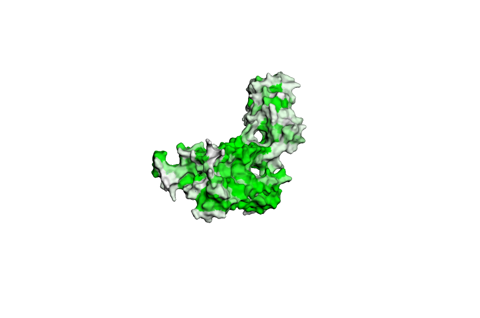
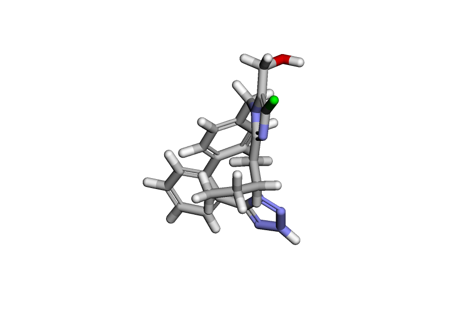
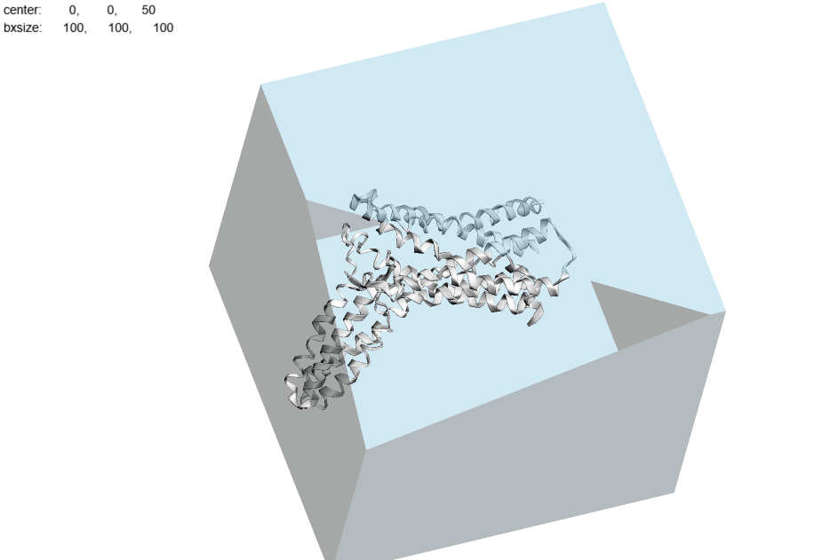
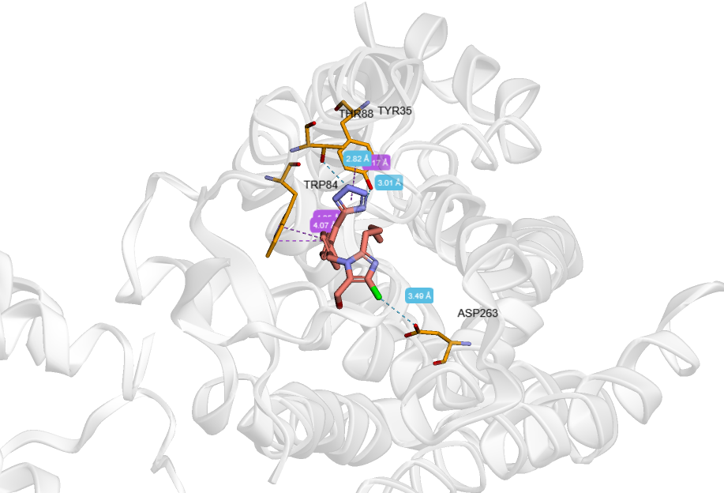

# Лозартан
a. Действующее вещество
Лозартан калия (Losartan potassium) — синтетическое соединение, блокирующие рецепторы ангиотензина II. В комбинированных препаратах (например, Лозартан Н) может дополнительно содержаться гидрохлоротиазид.

b. Область применения

    Артериальная гипертензия (гипертония) у взрослых и детей с 6 лет
    Хроническая сердечная недостаточность (у пациентов с противопоказаниями к ингибиторам АПФ)
    Защита почек при диабете 2 типа (диабетическая нефропатия)
    Снижение протеинурии (более 2 г/сутки)
    Вспомогательно при подагре (снижение воспаления и боли)

c. Молекулярный механизм действия
Лозартан является селективным антагонистом рецепторов ангиотензина II типа AT₁. Ангиотензин II — основной гормон ренин-ангиотензин-альдостероновой системы (РААС), который вызывает сужение сосудов (вазоконстрикцию) и стимулирует секрецию альдостерона. Блокируя AT₁-рецепторы, лозартан предотвращает эти эффекты, что приводит к расширению сосудов, снижению периферического сопротивления и артериального давления. В печени лозартан метаболизируется в активный метаболит E3174, который в 10-40 раз активнее оригинального вещества и усиливает блокаду рецепторов.

# Результаты докинга

[Результат докинга](LORZATAN_1.pdb)

Ноутбук, который вы приложили на ветке мейн не получилось запустить. Пришлось перейти на ветку develop и использовать старый рантайм питона (2025.07), поставив numpy 1.25
[Ноутбук](docking.ipynb)

